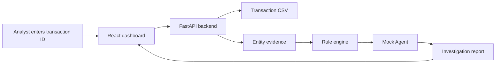

# FraudGuard Agent

FraudGuard Agent is a real-time fraud investigation assistant for transaction review. Instead of only predicting a binary fraud label, it retrieves transaction context, builds entity-level risk evidence, matches review rules, and generates a structured investigation report for analysts.

The MVP runs fully offline with a deterministic mock Agent, so it can be demoed without an LLM API key.

## Why This Project

Fraud detection projects often stop at offline binary classification. FraudGuard Agent focuses on the analyst-assist workflow around in-transaction fraud review:

- Real-time transaction lookup.
- User, device, IP, and merchant evidence aggregation.
- Rule hits separated from ground-truth labels for auditability.
- Risk score and risk level generation.
- Evidence-chain style investigation report.
- Human-in-the-loop review positioning.
- Mock Agent fallback before optional LLM/RAG integration.

## Features

- Query a transaction by ID.
- Inspect transaction details and historical entity behavior.
- Match deterministic fraud rules for high-value and anomalous access patterns.
- Generate a structured mock Agent report with evidence and suggested action.
- Use a React dashboard for resume-friendly demos and screenshots.
- Run locally with Python/Node or with Docker Compose.

## Tech Stack

- Backend: FastAPI, Pydantic, Python
- Frontend: React, TypeScript, Vite
- Data: synthetic CSV transactions and Markdown rules
- Agent layer: deterministic mock investigation Agent
- Deployment: Docker Compose

## Architecture



More detail: [docs/architecture.md](docs/architecture.md)

## Quick Start With Docker

From the repository root:

```bash
docker compose up --build
```

Open:

```text
http://127.0.0.1:5173
```

Analyze sample transaction:

```text
T1002
```

The backend API is available at:

```text
http://127.0.0.1:8000/docs
```

## Local Development

Start the backend:

```bash
cd backend
pip install -r requirements.txt
uvicorn app.main:app --reload
```

Start the frontend in another terminal:

```bash
cd frontend
pnpm install
pnpm run dev
```

Open:

```text
http://127.0.0.1:5173
```

The dashboard calls `http://127.0.0.1:8000` by default. Set `VITE_API_BASE_URL` if the backend runs elsewhere.

## API Overview

```http
GET /health
GET /transactions/{transaction_id}
GET /investigations/{transaction_id}
```

Example:

```bash
curl http://127.0.0.1:8000/investigations/T1002
```

`T1002` returns a high-risk mock investigation with rule hits for large amount and new device/IP context.

Full API notes: [docs/api.md](docs/api.md)

## Sample Data

Sample transaction IDs:

- `T1001`: low-risk normal transaction.
- `T1002`: high-value transaction from a new device/IP.
- `T1003`: repeat low-risk transaction.
- `T1004`: medium-risk high-value transaction with limited history.

Data source:

```text
data/sample_transactions.csv
```

Rules and review guidance:

```text
data/rules.md
```

## Demo Screenshot Guide

For a resume or portfolio screenshot, run the dashboard and analyze `T1002`. Capture:

- The transaction search input.
- High risk level and risk score.
- Rule hit cards.
- Evidence chain.
- Mock Agent suggested action.

Detailed demo flow: [docs/demo.md](docs/demo.md)

## Current MVP Status

Completed:

- FastAPI transaction query API.
- Entity evidence aggregation.
- Deterministic rule engine.
- Mock investigation Agent.
- React dashboard.
- Docker Compose setup.
- README, API, architecture, and demo docs.

Planned:

- RAG retrieval over `data/rules.md`.
- `LLMProvider` interface.
- Optional OpenAI-compatible LLM mode.
- Mock fallback mode for reproducible demos.
- More realistic synthetic data and case notes.

## Resume Bullets

English:

Built a real-time fraud investigation Agent integrating transaction profiling, rule retrieval, risk feature analysis, and evidence-chain generation. Designed a mock Agent fallback and analyst dashboard to support reproducible demos without external LLM dependencies.

Chinese:

构建面向事中反欺诈场景的智能风险研判 Agent，集成交易画像查询、规则匹配、风险特征分析与证据链生成能力；实现本地 mock Agent 与可视化分析面板，在无外部 LLM API 的情况下支持完整可复现演示。
