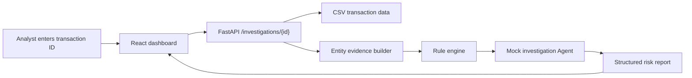

# Architecture

FraudGuard Agent is organized as a small full-stack investigation workflow. The MVP keeps the Agent deterministic so the project can run without external API keys.

## High-Level Flow

1. User submits a transaction ID in the dashboard.
2. Backend retrieves transaction profile and related entities.
3. Backend aggregates user history, device/IP usage, merchant exposure, and rule hits.
4. Mock Agent turns the risk facts into a structured investigation report.
5. Frontend displays risk score, evidence chain, matched rules, and suggested action.

## Main Modules

- `backend/`: API service and data access layer.
- `agent/`: tool definitions, prompts, and investigation workflow.
- `frontend/`: risk investigation dashboard.
- `data/`: synthetic sample data and rule documents.
- `docs/`: architecture, resume notes, and design decisions.

## Current MVP Scope

- Reads synthetic transactions from `data/sample_transactions.csv`.
- Computes simple user, device, IP, and merchant evidence.
- Applies deterministic fraud rules for high-value and anomalous access patterns.
- Generates a mock Agent report with `risk_level`, `risk_score`, evidence, fraud pattern, suggested action, and caveats.
- Serves a React dashboard for manual investigation demos.

## Future LLM/RAG Upgrade

The next phase should keep mock mode as the default fallback and add:

- Rule retrieval over `data/rules.md`.
- An `LLMProvider` interface.
- Optional OpenAI-compatible API support through environment variables.
- A retrieved-rule section in the investigation report for auditability.
