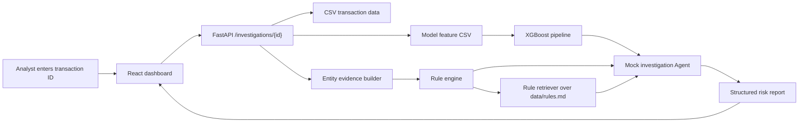

# Architecture

FraudGuard Agent is organized as a small full-stack investigation workflow. The MVP keeps the Agent deterministic so the project can run without external API keys.

## High-Level Flow

1. User submits a transaction ID in the dashboard.
2. Backend retrieves transaction profile and related entities.
3. Backend scores the transaction with the local XGBoost fraud model.
4. Backend aggregates user history, device/IP usage, merchant exposure, and rule hits.
5. Local RAG retrieves relevant review guidance from `data/rules.md`.
6. Mock Agent turns the model output, risk facts, and retrieved rules into a structured investigation report.
7. Frontend displays model probability, risk score, evidence chain, matched rules, retrieved rules, and suggested action.

## Main Modules

- `backend/`: API service and data access layer.
- `agent/`: tool definitions, prompts, and investigation workflow.
- `frontend/`: risk investigation dashboard.
- `data/`: synthetic sample data and rule documents.
- `docs/`: architecture, resume notes, and design decisions.

## Current MVP Scope

- Reads synthetic transactions from `data/sample_transactions.csv`.
- Loads model features from `data/model_features.csv`.
- Scores fraud probability with `models/credit_card_fraud/fraud_detection_pipeline.joblib`.
- Computes simple user, device, IP, and merchant evidence.
- Applies deterministic fraud rules for high-value and anomalous access patterns.
- Retrieves relevant review rules from `data/rules.md` as local RAG context.
- Generates a mock Agent report with `risk_level`, `risk_score`, evidence, fraud pattern, suggested action, and caveats.
- Serves a React dashboard for manual investigation demos.

## Future LLM Upgrade

The next phase should keep mock mode as the default fallback and add:

- An `LLMProvider` interface.
- Optional OpenAI-compatible API support through environment variables.
- Prompt construction from transaction facts, model prediction, rule hits, and retrieved rules.
- Structured JSON parsing with fallback to the deterministic mock Agent.
